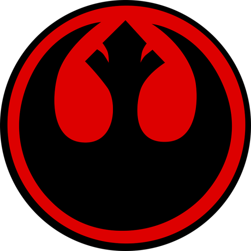
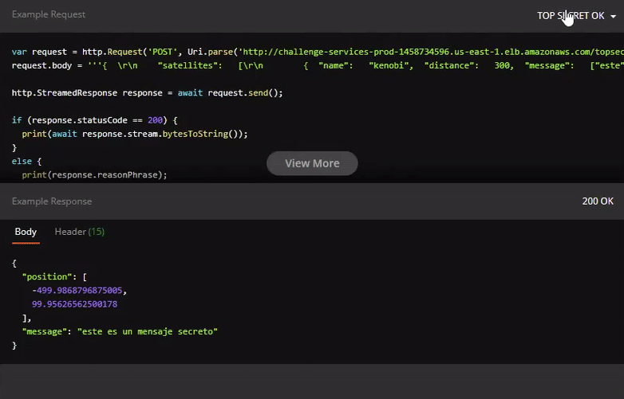

# Operación Fuego de Quasar

## Description

</img>

This repository contains the source code of _Operation Fire Quasar_ MELI challenge

> Como jefe de comunicaciones rebelde, tu misión es crear un programa que retorne la fuente y contenido del mensaje de auxilio . Para esto, cuentas con tres satélites que te permitirán triangular la posición, ¡pero cuidado! el mensaje puede no llegar completo a cada satélite debido al campo de asteroides frente a la nave.

### Default Satellites Positions

- Kenobi:   [-500,   -200]  
- Skywalker:   [100,   -100]  
- Sato:   [500,   100] 

## Installation

```bash
$ npm install
```
### Prerequisites  

- NodeJs `^14.0` 
- Docker & docker-compose (if execute under a docker container)

### Environment

Create an `.env` file on root of proyect or export the requiered environment variables, you can check for the required env vars on `.env.example` file

## Running the app

Run the following to start the app locally
```bash
# development watch mode
$ npm run start:dev

# production mode
$ npm run start:prod
```
To run it using Docker do the following

```bash
# run it on docker container
$ make up

# shut down running docker container
$ make down
```
Check `Makefile` for more details

## Command Execute

For the _ship-location_ you must pass at least and **only 3** distances params for each default satellite 

For the _decode-message_ command you can change the input data by editing the file `src/cmd/messages.ts`

```bash
# Get Location
$ npm run cmd ship-location 300 632.45 1000

# Get Message
$ npm run cmd decode-message
```

## API

Operations Fire Quasar is available under _AWS ECS Service_, you can check the api documentation here:

[OP FIRE QUASAR | API DOCUMENTATION](https://documenter.getpostman.com/view/19076484/UVXesdtv)

To check some **success** and **error** examples on each endpoint you can change the response example at the top of each request.

</img>

>💡 Note: Remember that you need to attach a valid `x-api-key` on each request. This is set as a minimum security layer

## Test

```bash
# unit tests
$ npm run test

# e2e tests
$ npm run test:e2e

# test coverage
$ npm run test:cov
```

## Framework

<a href="http://nestjs.com/" target="blank"></a>

[Nest](https://github.com/nestjs/nest) is a TypeScript progressive <a href="http://nodejs.org" target="_blank">Node.js</a> framework for building efficient and scalable server-side applications.

Nest is an MIT-licensed open source project. It can grow thanks to the sponsors and support by the amazing backers. [read more here](https://docs.nestjs.com/support).

<br>

___

<right> _Author:_ [@bastian_af](https://github.com/avflo)</right>
